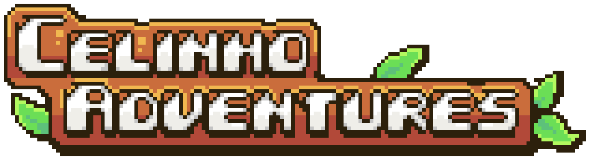

<!-- Improved compatibility of back to top link: See: https://github.com/othneildrew/Best-README-Template/pull/73 -->

  <picture>
    
  </picture>
  <picture>
    
  </picture>
  <picture>
    
  </picture> 
  

<!-- PROJECT LOGO -->
 

  

<h3 align="center">🎮 Celinho Adventures</h3>

  

    Short story-oriented RPG 
    <!--  
    <a href="https://github.com/bpsoraggi/Personal-Projects/Games/Kûara"><strong>Explore the docs »</strong></a>
     
     
    <a href="https://github.com/bpsoraggi/Personal-Projects/Games/Kûara">View Demo</a>
    ·
    <a href="https://github.com/bpsoraggi/Personal-Projects/Games/Kûara/issues">Report Bug</a>
    ·
    <a href="https://github.com/bpsoraggi/Personal-Projects/Games/Kûara/issues">Request Feature</a> -->
  

<!-- TABLE OF CONTENTS -->

  
Table of Contents

  <ol>
    <li>
      <a href="#-about-the-project">About The Project</a>
      <ul>
        <li><a href="#-built-with">Built With</a></li>
      </ul>
    </li>
    <li>
      <a href="#-showcase">Showcase</a>
     <ul>
        <li><a href="#map">Map</a></li>
      </ul>
      <ul>
        <li><a href="#dialogue">Dialogue</a></li>
      </ul>
     <ul>
        <li><a href="#cutscenes">Cutscenes</a></li>
      </ul>
     <ul>
        <li><a href="#room-changes">Room Changes</a></li>
      </ul>
     <ul>
        <li><a href="#combat">Combat</a></li>
      </ul>
    </li>
    <li><a href="#-usage">Usage</a></li>
    <li><a href="#-acknowledgments">Acknowledgments</a></li>
    <li><a href="#-credit">Credit</a></li>
    <li><a href="#phone-contact">Contact</a></li>
  </ol>

<!-- ABOUT THE PROJECT -->
## 📚 About The Project

  

This game was created as a birthday gift for my boyfriend and was my first 100% solo project, as well as my very first game. The art was very heavily inspired in **Littlewood** by *Sean Young*, I do NOT own any of it. I only used the art as a base because I wanted to focus on the coding aspect of building a game.

(<a href="#readme-top">back to top</a>)

### 🔨 Built With

* 
* 
<!-- * [![Angular][Angular.io]][Angular-url] -->

(<a href="#readme-top">back to top</a>)

<!-- DEVLOG -->
## 🔦 Showcase

Here is where I'll be sharing some of the development process. Just a few snippets here and there, nothing too extended.

### Map

  
  

     
   &nbsp &nbsp &nbsp Here is a small showcase of the main map. I implemented a simple  
   &nbsp &nbsp &nbsp mechanism to make the buildings transparent whenever the player  
   &nbsp &nbsp &nbsp is behind them to make it easier to see, since the player is relatively  
   &nbsp &nbsp &nbsp small and easy to miss.
     
   &nbsp &nbsp &nbsp In my next game, the camera will be a bit more zoomed in.
  

     

(<a href="#readme-top">back to top</a>)

-------
### Dialogue

  
&nbsp; &nbsp; &nbsp; &nbsp;
  

I used a dialogue engine to help out, but ended up changing a lot of the code to fit my specific vision for the game. Above, you can see two examples of dialogue: 
1) **In a cutscene (right):** Dialogue inside cutscenes were slightly different to normal dialogues because I had to find a way to include them within the cutscene engine that I used for the game.
2) **Normal dialogue (right):** In this specific case, you can also see the implementation of different choices for the player to choose from when interacting with NPCs.
-------
### Cutscenes

  
  

     
   &nbsp &nbsp &nbsp Another example of cutscene. I didn't have much time to work on  
   &nbsp &nbsp &nbsp the AI for the cows because they only showed up in this once scene.  
   &nbsp &nbsp &nbsp The player cannot move or do anything while this scene plays. It is  
   &nbsp &nbsp &nbsp one of my plans to implement <b>skipable</b> cutscenes in the next game.   
   &nbsp &nbsp &nbsp The speech bubble used in this scene is part of the dialogue engine.
  

     

(<a href="#readme-top">back to top</a>)

-------
### Room Changes

 
  

     
   For room changes, I used a similar logic to dialogue bubbles. When a player comes near an enterable door, it detects the object and draws the bouncing action sprite. Once the player touches the object, it runs the       code for room swapping and checks which room it needs to go to based on the object properties.
 

  

(<a href="#readme-top">back to top</a>)

-------
### Combat

  
&nbsp; &nbsp; &nbsp; &nbsp;
  

For the combat aspect of the game, I kept it simple because it wasn't the focus I wanted. I implemented a dash mechanism where the player's hitbox doesn't exist for a few seconds, allowing them to go through walls and enemies. The dash has a cooldown to prevent exploitation.
  
The boss was also quite simple, with a pretty basic projectile mechanism that works with the dash mentioned above. For the pruposes of showcasing, I altered the boss's max hp to something lower in order to be able to demonstrate the death animation.

<!-- USAGE EXAMPLES -->
## 🪧 Usage

Celinho Adventures is a fully private project and is not available for download anywhere.

(<a href="#readme-top">back to top</a>)

<!-- ACKNOWLEDGMENTS -->
## 🤝 Acknowledgments

<!-- color: $\large{\color{teal}\sf{loremipsum}}$ -->

* <b>Célio Carvalho</b> 
The inspiration and reason for the creation of this project.
* <b>Arthur Torres</b> 
Helped with ideas for lore and pacing.
* <b>Ponto e Vírgula</b> channel on *YouTube* 
Provided me with wonderful tutorials that helped me as a beginner on GameMaker.

(<a href="#readme-top">back to top</a>)

<!-- CREDIT -->
## 📝 Credit

>**Cutscene Engine by Pikku-a**, *GameMaker Marketplace* 
Engine used for the game's cutscenes.

>**Littlewood by Sean Young**, *Steam* 
The art in Celinho Adventures was heavily inspired by the art in Littlewood.

>**EndOfAnimation function by unknown**, *Stack Overflow* 
Function used in several scripts, author not known.

(<a href="#readme-top">back to top</a>)

<!-- CONTACT -->
## :phone: Contact

Project Link: [https://github.com/bpsoraggi/Personal-Projects/Games/Kûara](https://github.com/bpsoraggi/Personal-Projects/Games/Kûara)

(<a href="#readme-top">back to top</a>)

<!-- MARKDOWN LINKS & IMAGES -->
<!-- https://www.markdownguide.org/basic-syntax/#reference-style-links -->
[contributors-shield]: https://img.shields.io/github/contributors/bpsoraggi/Personal-Projects/Games/Kûara.svg?style=for-the-badge
[contributors-url]: https://github.com/bpsoraggi/Personal-Projects/Games/Kûara/graphs/contributors
[forks-shield]: https://img.shields.io/github/forks/bpsoraggi/Personal-Projects/Games/Kûara.svg?style=for-the-badge
[forks-url]: https://github.com/bpsoraggi/Personal-Projects/Games/Kûara/network/members
[stars-shield]: https://img.shields.io/github/stars/bpsoraggi/Personal-Projects/Games/Kûara.svg?style=for-the-badge
[stars-url]: https://github.com/bpsoraggi/Personal-Projects/Games/Kûara/stargazers
[issues-shield]: https://img.shields.io/github/issues/bpsoraggi/Personal-Projects/Games/Kûara.svg?style=for-the-badge
[issues-url]: https://github.com/bpsoraggi/Personal-Projects/Games/Kûara/issues
[license-shield]: https://img.shields.io/github/license/bpsoraggi/Personal-Projects/Games/Kûara.svg?style=for-the-badge
[license-url]: https://github.com/bpsoraggi/Personal-Projects/Games/Kûara/blob/master/LICENSE.txt
[linkedin-shield]: https://img.shields.io/badge/-LinkedIn-black.svg?style=for-the-badge&logo=linkedin&colorB=555
[linkedin-url]: https://linkedin.com/in/bpsoraggi
[product-screenshot]: images/screenshot.png
[Next.js]: https://img.shields.io/badge/next.js-000000?style=for-the-badge&logo=nextdotjs&logoColor=white
[Next-url]: https://nextjs.org/
[React.js]: https://img.shields.io/badge/React-20232A?style=for-the-badge&logo=react&logoColor=61DAFB
[React-url]: https://reactjs.org/
[Vue.js]: https://img.shields.io/badge/Vue.js-35495E?style=for-the-badge&logo=vuedotjs&logoColor=4FC08D
[Vue-url]: https://vuejs.org/
[Angular.io]: https://img.shields.io/badge/Angular-DD0031?style=for-the-badge&logo=angular&logoColor=white
[Angular-url]: https://angular.io/
[Svelte.dev]: https://img.shields.io/badge/Svelte-4A4A55?style=for-the-badge&logo=svelte&logoColor=FF3E00
[Svelte-url]: https://svelte.dev/
[Laravel.com]: https://img.shields.io/badge/Laravel-FF2D20?style=for-the-badge&logo=laravel&logoColor=white
[Laravel-url]: https://laravel.com
[Bootstrap.com]: https://img.shields.io/badge/Bootstrap-563D7C?style=for-the-badge&logo=bootstrap&logoColor=white
[Bootstrap-url]: https://getbootstrap.com
[JQuery.com]: https://img.shields.io/badge/jQuery-0769AD?style=for-the-badge&logo=jquery&logoColor=white
[JQuery-url]: https://jquery.com 
