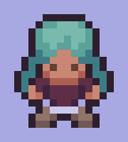

<!-- Improved compatibility of back to top link: See: https://github.com/othneildrew/Best-README-Template/pull/73 -->

<!--
*** Thanks for checking out the Best-README-Template. If you have a suggestion
*** that would make this better, please fork the repo and create a pull request
*** or simply open an issue with the tag "enhancement".
*** Don't forget to give the project a star!
*** Thanks again! Now go create something AMAZING! :D
-->

<!-- PROJECT SHIELDS -->
<!--
*** I'm using markdown "reference style" links for readability.
*** Reference links are enclosed in brackets [ ] instead of parentheses ( ).
*** See the bottom of this document for the declaration of the reference variables
*** for contributors-url, forks-url, etc. This is an optional, concise syntax you may use.
*** https://www.markdownguide.org/basic-syntax/#reference-style-links

[![Contributors][contributors-shield]][contributors-url]
[![Forks][forks-shield]][forks-url]
[![Stargazers][stars-shield]][stars-url]
[![Issues][issues-shield]][issues-url]
[![MIT License][license-shield]][license-url]
[![LinkedIn][linkedin-shield]][linkedin-url] -->

  <picture>
    
  </picture>
  <picture>
    
  </picture>
  <picture>
    
  </picture> 
  

<!-- PROJECT LOGO -->
 

  

<h3 align="center">🎮 Kûara (Possible temporary name)</h3>

  

    Crafting, story-oriented RPG, currently under development
    <!--  
    <a href="https://github.com/bpsoraggi/Personal-Projects/Games/Kûara"><strong>Explore the docs »</strong></a>
     
     
    <a href="https://github.com/bpsoraggi/Personal-Projects/Games/Kûara">View Demo</a>
    ·
    <a href="https://github.com/bpsoraggi/Personal-Projects/Games/Kûara/issues">Report Bug</a>
    ·
    <a href="https://github.com/bpsoraggi/Personal-Projects/Games/Kûara/issues">Request Feature</a> -->
  

<!-- TABLE OF CONTENTS -->

 

  
Table of Contents

  <ol>
    <li>
      <a href="#-about-the-project">About The Project</a>
      <ul>
        <li><a href="#-built-with">Built With</a></li>
      </ul>
    </li>
    <li>
      <a href="#heavy_check_mark-devlog">DevLog</a>
      <ul>
        <li><a href="#june-22nd">June 22nd</a></li>
      </ul>
    </li>
    <li><a href="#-usage">Usage</a></li>
    <li><a href="#-license">License</a></li>
    <li><a href="#-acknowledgments">Acknowledgments</a></li>
    <li><a href="#-credit">Credit</a></li>
    <li><a href="#phone-contact">Contact</a></li>
  </ol>

<!-- ABOUT THE PROJECT -->
## 📚 About The Project

  

Kûara (possible temporary name) will be a crafting top-down game. I plan on having the story element be a very prominent feature, but not the only thing about the game. The player will be able to follow the lore through cutscenes, perhaps a few story choices along the way, and also through visual hints scattered through the map. Once the story is "complete", the game will still be playable and the player will still be able to craft and expand their house/village, etc., similar to how you can still play Minecraft even after defeating the Ender Dragon.

I will keep a few devlogs here to track my progress, but I plan on not exposing too much of the game, especially not story-wise.

(<a href="#readme-top">back to top</a>)

### 🔨 Built With

* 
* 
* 
<!-- * [![Angular][Angular.io]][Angular-url] -->

(<a href="#readme-top">back to top</a>)

<!-- DEVLOG -->
## :heavy_check_mark: DevLog

Here is where I'll be sharing some of the development process. Just a few snippets here and there, nothing too extended.

### June 22nd

  
  

       
    &nbsp &nbsp &nbsp A lot of the art is done, maybe 20%, depending  
    &nbsp &nbsp &nbsp on how many items there will be in the end. I've  
    &nbsp &nbsp &nbsp done a couple of action animations as well, as  
    &nbsp &nbsp &nbsp can be seen to the left. Right now I'm currently  
    &nbsp &nbsp &nbsp working on the inventory and crafting system,  
    &nbsp &nbsp &nbsp my plan is to have the shell ready first, then go  
    &nbsp &nbsp &nbsp back and polish it later once other features are  
    &nbsp &nbsp &nbsp complete.
  

     

(<a href="#readme-top">back to top</a>)

<!-- USAGE EXAMPLES -->
## 🪧 Usage

Once fully developed, Kûara will probably be uploaded to itch.io.

(<a href="#readme-top">back to top</a>)

<!-- LICENSE -->
## 📇 License

All rights reserved. See `LICENSE.txt` for more information.

(<a href="#readme-top">back to top</a>)

<!-- ACKNOWLEDGMENTS -->
## 🤝 Acknowledgments

<!-- color: $\large{\color{teal}\sf{loremipsum}}$ -->

* <b>Célio Carvalho</b> 
Greatly helped in coming up with the initial lore for the game, as well as giving feedback on the art and implementation of features.

(<a href="#readme-top">back to top</a>)

<!-- CREDIT -->
## 📝 Credit

>**Snoblin**, *itch.io* 
Some of the sprites in Kûara were made using Snoblin's assets as a base.

>**danieldiggle**, *itch.io* 
Some of the sprites in Kûara were made using danieldiggle's assets as a base.

(<a href="#readme-top">back to top</a>)

<!-- CONTACT -->
## :phone: Contact

Project Link: [https://github.com/bpsoraggi/Personal-Projects/Games/Kûara](https://github.com/bpsoraggi/Personal-Projects/Games/Kûara)

(<a href="#readme-top">back to top</a>)

<!-- MARKDOWN LINKS & IMAGES -->
<!-- https://www.markdownguide.org/basic-syntax/#reference-style-links -->
[contributors-shield]: https://img.shields.io/github/contributors/bpsoraggi/Personal-Projects/Games/Kûara.svg?style=for-the-badge
[contributors-url]: https://github.com/bpsoraggi/Personal-Projects/Games/Kûara/graphs/contributors
[forks-shield]: https://img.shields.io/github/forks/bpsoraggi/Personal-Projects/Games/Kûara.svg?style=for-the-badge
[forks-url]: https://github.com/bpsoraggi/Personal-Projects/Games/Kûara/network/members
[stars-shield]: https://img.shields.io/github/stars/bpsoraggi/Personal-Projects/Games/Kûara.svg?style=for-the-badge
[stars-url]: https://github.com/bpsoraggi/Personal-Projects/Games/Kûara/stargazers
[issues-shield]: https://img.shields.io/github/issues/bpsoraggi/Personal-Projects/Games/Kûara.svg?style=for-the-badge
[issues-url]: https://github.com/bpsoraggi/Personal-Projects/Games/Kûara/issues
[license-shield]: https://img.shields.io/github/license/bpsoraggi/Personal-Projects/Games/Kûara.svg?style=for-the-badge
[license-url]: https://github.com/bpsoraggi/Personal-Projects/Games/Kûara/blob/master/LICENSE.txt
[linkedin-shield]: https://img.shields.io/badge/-LinkedIn-black.svg?style=for-the-badge&logo=linkedin&colorB=555
[linkedin-url]: https://linkedin.com/in/bpsoraggi
[product-screenshot]: images/screenshot.png
[Next.js]: https://img.shields.io/badge/next.js-000000?style=for-the-badge&logo=nextdotjs&logoColor=white
[Next-url]: https://nextjs.org/
[React.js]: https://img.shields.io/badge/React-20232A?style=for-the-badge&logo=react&logoColor=61DAFB
[React-url]: https://reactjs.org/
[Vue.js]: https://img.shields.io/badge/Vue.js-35495E?style=for-the-badge&logo=vuedotjs&logoColor=4FC08D
[Vue-url]: https://vuejs.org/
[Angular.io]: https://img.shields.io/badge/Angular-DD0031?style=for-the-badge&logo=angular&logoColor=white
[Angular-url]: https://angular.io/
[Svelte.dev]: https://img.shields.io/badge/Svelte-4A4A55?style=for-the-badge&logo=svelte&logoColor=FF3E00
[Svelte-url]: https://svelte.dev/
[Laravel.com]: https://img.shields.io/badge/Laravel-FF2D20?style=for-the-badge&logo=laravel&logoColor=white
[Laravel-url]: https://laravel.com
[Bootstrap.com]: https://img.shields.io/badge/Bootstrap-563D7C?style=for-the-badge&logo=bootstrap&logoColor=white
[Bootstrap-url]: https://getbootstrap.com
[JQuery.com]: https://img.shields.io/badge/jQuery-0769AD?style=for-the-badge&logo=jquery&logoColor=white
[JQuery-url]: https://jquery.com 
